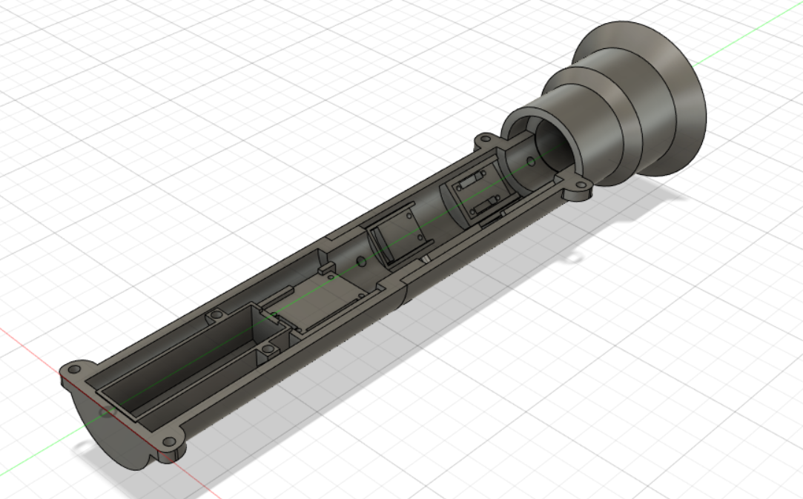

# OpenSaber

An LED lightsaber, designed and built from scratch. This project took a while to complete, mostly due to classes and tests, but it's finally done!

    
    
    

My goal with this document isn't to analyze every step of the process in building this project, but merely to point out the parts that I found particularly interesting, challenging or fun. Therefore, this probably isn't a proper "postmortem", but rather a "highlights reel", maybe.

## High-Level Overview

I designed hilt of the lightsaber using Fusion360, and then 3d-printed it. The hilt is made of 5 pieces, and held together by screws. The blade is a frosted acrylic tube, with a strip of LEDs inside.

### Electronics

Inside the hilt, there is a microcontroller (Trinket M0), a gyroscope (MPU6050), a speaker, an audio amplifier, a power converter (5V boost), and a Li-Ion battery. The single microcontroller runs the lights, sounds, user input, and reads sensor information from the gyro. Using the rotational velocity information, the brightness of the blade and the volume of the lightsaber is dynamically adjusted according to how fast the lightsaber is swinging, which makes the blade feel more "alive". The LED strip in the blade is individually-addressable, allowing the  blade to be any color, as well as having ignition and extinguishing animations.

### Physical

Since my 3D printer has a size limitation of <6 inches in each dimension, the hilt needed to be printed in several pieces. There are 2 back pieces, 2 front pieces, and then an emitter piece, which is where the blade is mounted. The electronics are mounted into the back pieces, and the user controls are mounted on the front pieces.

I'm not particularly skilled with CAD, so the first draft of the hilt was pretty bad. I highly overestimated the space I had inside the hilt, so I designed hilt to be mostly solid plastic, with mounting points for the electronics. 

    

As you can see, in the second iteration I tried to mount electronics on the inner walls, resulting in much more space.

    
    

You'll notice that on the bottom of the hilt there's a hole. This was intended for a charging cable, so the lightsaber could be charged by just plugging it in. However, with the amount of wires filling up the inside of the hilt, there was no room for such a thick cable, so that had to be scrapped. As a result, unfortunately, in order to charge the battery, the hilt must be disassembled.

## Roadblock - LED Write Latency

A major problem I ran into early in the project was the issue of having the singular microcontroller driving everything at the same time. For example, while the lightsaber is on, the microcontroller must monitor the gyro, send audio signals, adjust the LEDs, and handle user input. 

The microcontroller sends audio signals using an analog output, which allows it to dynamically change the volume according to the speed of the saber. A downside of this, however, is that audio data cannot be buffered, which would allow for much more flexible timing. Therefore, the audio must be played real-time, which means that the timing should be very consistent. While the lightsaber is on, the sound is played back at a frequency of 6kHz, which means that the loop period should be, at maximum, 0.000167 seconds, or 167 microseconds. Normally, this should be fine, and would be well within the abilities of the microcontroller. However, updating the LED strip complicates things, for a few reasons.

First, updating the LEDs is fairly expensive, and would cause the loop time to exceed the maximum allowable period. Second, the library being used for the LEDs, the Adafruit NeoPixel library, suspends interrupts while running. Since all mechanisms to measure time depend on interrupts, the system would have no way of knowing how much time was spent commanding the LEDs, and would therefore mess up all scheduling logic.

The best solution I found through research was to change the LED update mechanism to DMA. DMA, or Direct Memory Access, would essentially repurpose the communication hardware on the microcontroller (such as I2C, SPA, etc.) to instead send signals to the LEDs. Since this communication is handled by the hardware, this would happen completely independently of the CPU, so updating the LEDs would become absolutely free, in terms of CPU time.

However, an issue was that the communication hardware was already in use, since the gyro uses I2C (a communication protocol) to send data to the microcontroller. The microcontroller can't do both DMA and I2C at the same time, which is obviously a problem.

My solution to this problem was to bit-bang the I2C communication with the gyro. "Bit-banging" is when you use software to do things that would normally be done by hardware. That is, the protocol would be handled by individually flipping pins low and high in software. Since the existing gyro library uses the hardware I2C, I had to rewrite the gyro library from scratch to use the bit-banged I2C implementation. There were a lot of little bugs that came up here, since I was trying to get meaningful information by writing low-level communication from scratch. After a while (and frying a gyro) I was able to iron out all the issues with my gyro library, and it's working pretty reliably.

Obviously, since the I2C is now being run in software, we lose some of the advantage we gained from switching the LEDs to DMA. However, it's still a significant net-positive, since the bit-banged I2C is still reasonably fast.

The new code can comfortably run everything at the required 6kHz update speed, so everything works like a charm. In fact, during the ignition and extinguish animations, since there is no gyro needed, the cycle is run at 12kHz instead of 6, resulting in a little better sound quality.
